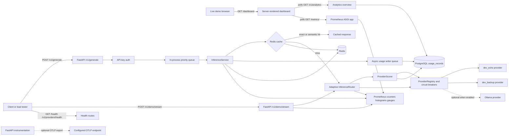

# InferX

InferX is a backend inference gateway that puts one API in front of multiple model providers and centralizes the infrastructure concerns around that traffic: provider health, adaptive routing, failover, cache hits, API-key auth, request priority, usage logging, cost analysis, and observability.

The current repository is intentionally honest about scope. The local Docker stack is built around deterministic demo providers (`dev_echo` and `dev_backup`) so the gateway behavior can be tested, benchmarked, and demonstrated without relying on external LLM availability. Hosted provider adapters are represented in the interface and pricing catalog, but OpenAI, Gemini, Groq, and Sarvam HTTP adapters are roadmap work.

## Why This Exists

Applications that call model providers directly usually duplicate the same infrastructure in every service:

- provider selection and fallback when an upstream fails;
- latency and error tracking per provider;
- cache checks before expensive model calls;
- API-key auth, priority handling, and usage accounting;
- observability that can explain why a request went where it did;
- cost reporting from real request logs instead of estimates.

InferX pulls those concerns into a gateway. The app code behind it can call `/v1/generate`; the gateway owns routing, telemetry, and persistence.

## Current Status

Status labels are intentionally limited to:

- **Built & tested**: implemented and covered by automated tests and/or live Docker validation.
- **Built but not load-tested**: implemented and smoke-tested, but not included in the checked-in Locust benchmark.
- **Partial**: some code exists, but the capability is not complete.
- **Roadmap**: not implemented in the current repo.

| Capability | Status | Current repo evidence | Notes |
|---|---|---|---|
| FastAPI gateway app, lifespan wiring, Docker image | Built & tested | `app/main.py`, `Dockerfile`, `tests/integration/test_health_api.py` | App version is `0.1.0` in code. |
| Docker Compose stack | Built & tested | `docker-compose.yml` | API, Redis, PostgreSQL, Prometheus, and Locust profile. |
| API-key auth with local bootstrapped demo keys | Built & tested | `app/services/auth.py`, `tests/unit/test_auth.py` | Compose defaults bootstrap `inferx-free-local` and `inferx-premium-local`. |
| Premium/free priority queue | Built & tested | `app/routing/queue.py`, `tests/unit/test_queue.py` | In-process priority queue, not Redis-backed. |
| Provider interface and registry | Built & tested | `app/providers/base.py`, `app/providers/registry.py`, `tests/unit/test_provider_registry.py` | Provider contract is `generate`, `stream`, and `health_check`. |
| Local demo providers | Built & tested | `app/providers/adapters/dev.py`, `tests/unit/test_demo_provider.py` | Compose enables `dev_echo` and `dev_backup` by default. |
| Circuit breaker and failover | Built & tested | `app/routing/circuit_breaker.py`, `app/routing/router.py`, `tests/unit/test_circuit_breaker.py`, `tests/unit/test_routing_failover.py` | Failure threshold is `1` in Compose defaults and `3` in base settings. |
| Adaptive provider scoring | Built but not load-tested | `app/routing/provider_scoring.py`, `tests/unit/test_provider_scoring.py` | Scores every `60` seconds by default using recent latency, error rate, health, circuit state, and known cost. |
| Redis exact and semantic cache | Built & tested | `app/cache/redis_cache.py`, `tests/unit/test_cache.py` | Uses a local hashing embedder, not an external embedding model. |
| Async usage writer to PostgreSQL | Built & tested | `app/services/usage.py`, `app/db/models.py`, `alembic/versions/0001_create_auth_usage_tables.py` | Usage persistence is off the request path via an async queue. |
| Cost savings analytics from real usage records | Built & tested | `app/api/v1/analytics.py`, `app/services/cost_analytics.py`, `tests/unit/test_cost_analytics.py`, `tests/integration/test_analytics_api.py` | Unknown provider/model prices are left unpriced instead of estimated. |
| Live operations dashboard | Built but not load-tested | `app/api/dashboard.py`, `tests/integration/test_dashboard_api.py` | Polls `/v1/analytics` and `/metrics` every few seconds. |
| Demo streaming endpoint and kill/restore controls | Built but not load-tested | `app/api/v1/demo.py`, `docs/live-failover-demo.md` | Demo-only route under `/v1/demo/stream`; no public `/v1/stream` endpoint yet. |
| Prometheus metrics | Built & tested | `app/metrics/prometheus.py`, `ops/prometheus/prometheus.yml` | Mounted at `/metrics/`; `/metrics` redirects to `/metrics/`. |
| OpenTelemetry FastAPI instrumentation | Partial | `app/core/telemetry.py` | OTLP endpoint is configurable; no collector service is included in Compose. |
| Ollama adapter | Partial | `app/providers/adapters/ollama.py` | Non-streaming generate is implemented; stream currently wraps the full response. Disabled by default. |
| Hosted OpenAI/Gemini/Groq/Sarvam adapters | Roadmap | TODO files in `app/providers/adapters/` | Pricing catalog exists for analytics, but hosted HTTP adapters are not implemented. |
| Redis-backed rate limiting | Roadmap | `app/rate_limit/limiter.py` | Placeholder only. |
| Distributed request queue | Roadmap | `app/routing/queue.py` | Current queue is process-local. |
| Kafka, ClickHouse, Kubernetes, predictive routing, multi-region, SDK | Roadmap | `docs/roadmap.md` | Design notes are documented; code is not implemented. |

## Architecture

This diagram matches the current code paths. It does not include roadmap-only components as if they already existed.



## Repository Layout

```text
app/
  api/                  FastAPI route modules and dashboard HTML
  cache/                Redis exact/semantic cache and local hashing embedder
  core/                 settings, logging, errors, telemetry
  db/                   SQLAlchemy models and async session factory
  metrics/              Prometheus instrumentation
  providers/            provider contract, registry, adapters
  routing/              priority queue, circuit breaker, adaptive scorer, router
  services/             auth, inference orchestration, usage, cost analytics
alembic/                database migration setup
docs/                   live demo and roadmap docs
load-tests/             Locust workload and checked-in benchmark CSVs
ops/prometheus/         Prometheus scrape config
scripts/                API start script and cost-savings renderer
tests/                  unit and integration tests
```

## Quickstart

The copy-paste path below assumes a fresh checkout with no `.env` file. That matters because Compose provides demo-safe defaults that enable local dev providers, demo controls, and local API keys.

If you copy `.env.example` to `.env`, set at least these values for the examples below to work:

```env
BOOTSTRAP_DEV_DATA=true
LOCAL_FREE_API_KEY=inferx-free-local
LOCAL_PREMIUM_API_KEY=inferx-premium-local
ENABLE_DEV_PROVIDER=true
ENABLE_DEMO_CONTROLS=true
```

Start the stack:

```bash
docker compose up --build
```

Services exposed by Compose:

| Service | URL |
|---|---|
| API | `http://localhost:8000` |
| Prometheus | `http://localhost:9090` |
| PostgreSQL | `localhost:5432` |
| Redis | `localhost:6379` |

## Copy-Paste API Checks

Health:

```bash
curl -s http://localhost:8000/health
```

Expected response:

```json
{"status":"ok","app":"InferX","environment":"local"}
```

Provider health:

```bash
curl -s http://localhost:8000/v1/providers/health
```

Expected response on fresh Compose defaults:

```json
{"providers":{"dev_echo":"healthy","dev_backup":"healthy"},"circuits":{"dev_echo":"closed","dev_backup":"closed"},"configured_count":2}
```

Authenticated generation:

```bash
curl -s -X POST http://localhost:8000/v1/generate \
  -H 'Content-Type: application/json' \
  -H 'X-API-Key: inferx-premium-local' \
  -d '{"prompt":"explain queue depth briefly","model":"dev-gateway-benchmark"}'
```

Expected response on a fresh Redis cache:

```json
{"provider":"dev_echo","model":"dev-gateway-benchmark","output":"[dev_echo] explain queue depth briefly"}
```

Analytics overview:

```bash
sleep 1
curl -s 'http://localhost:8000/v1/analytics?window_seconds=300' | python3 -m json.tool
```

Prometheus metrics:

```bash
curl -s http://localhost:8000/metrics/ \
  | grep -E 'inferx_provider_requests_total|inferx_provider_score|inferx_cache_events_total|inferx_active_streaming_sessions'
```

Live dashboard:

```bash
open http://localhost:8000/dashboard
```

If `open` is not available, paste `http://localhost:8000/dashboard` into a browser.

## Live Failover Demo

The live demo uses only local providers. No external LLM account is required.

Open the runbook:

```bash
cat docs/live-failover-demo.md
```

Start a streaming request:

```bash
curl -N -X POST http://localhost:8000/v1/demo/stream \
  -H 'Content-Type: application/json' \
  -H 'X-API-Key: inferx-premium-local' \
  -d '{"prompt":"stream a short status update about provider routing","model":"demo-stream"}'
```

Expected first event with both providers healthy:

```text
event: route
data: {"provider": "dev_echo", "attempted_chain": ["dev_echo"]}
```

Kill the current provider and force an immediate score refresh:

```bash
curl -s -X POST http://localhost:8000/v1/demo/kill-provider \
  -H 'Content-Type: application/json' \
  -H 'X-API-Key: inferx-premium-local' \
  -d '{"provider":"dev_echo"}' | python3 -m json.tool
```

Send another streaming request:

```bash
curl -N -X POST http://localhost:8000/v1/demo/stream \
  -H 'Content-Type: application/json' \
  -H 'X-API-Key: inferx-premium-local' \
  -d '{"prompt":"stream after the primary provider is killed","model":"demo-stream"}'
```

Expected first event:

```text
event: route
data: {"provider": "dev_backup", "attempted_chain": ["dev_backup"]}
```

Restore the provider:

```bash
curl -s -X POST http://localhost:8000/v1/demo/restore-provider \
  -H 'Content-Type: application/json' \
  -H 'X-API-Key: inferx-premium-local' \
  -d '{"provider":"dev_echo"}' | python3 -m json.tool
```

Useful log filter while running the demo:

```bash
docker compose logs -f api \
  | grep -E 'demo provider|failover|circuit|demo stream|provider scored|provider score'
```

## Cost Savings Demo

The cost-savings endpoint reads real `usage_records` from PostgreSQL. It does not seed synthetic records.

Generate a small session and filter analytics to that session window:

```bash
SESSION_START=$(date -u +"%Y-%m-%dT%H:%M:%SZ")

curl -s -X POST http://localhost:8000/v1/generate \
  -H 'Content-Type: application/json' \
  -H 'X-API-Key: inferx-premium-local' \
  -d '{"prompt":"cost savings session alpha","model":"dev-gateway-benchmark"}'

curl -s -X POST http://localhost:8000/v1/generate \
  -H 'Content-Type: application/json' \
  -H 'X-API-Key: inferx-premium-local' \
  -d '{"prompt":"cost savings session alpha","model":"dev-gateway-benchmark"}'

sleep 1

curl -s http://localhost:8000/v1/analytics/cost-savings \
  -H 'X-API-Key: inferx-premium-local' \
  --get --data-urlencode "since=$SESSION_START" \
  | python3 -m json.tool
```

Render a screenshot-ready HTML card:

```bash
python3 scripts/render_cost_savings.py \
  --base-url http://localhost:8000 \
  --api-key inferx-premium-local \
  --since "$SESSION_START" \
  --out artifacts/cost-savings.html
```

The report includes:

- actual spend by logged provider/model/cache tier;
- prompt, completion, and total token counts from persisted usage rows;
- per-token pricing from `app/services/pricing.py` when available;
- a counterfactual where all logged requests are priced against the most expensive priced catalog entry;
- percent saved when all upstream rows have known pricing.

If pricing is missing for a provider/model, the row is marked unpriced and savings percent is omitted instead of estimated.

## Benchmarks

The checked-in benchmark is a Locust benchmark against `POST /v1/generate` using the local `dev_echo` provider. It measures gateway overhead, queue behavior, cache behavior, and usage-write behavior. It does not measure real hosted LLM latency or output quality.

Benchmark date in `bench-results.md`: `2026-07-02`.

Benchmark setup from `bench-results.md`:

| Setting | Value |
|---|---|
| Stack | Docker Compose API, Redis, PostgreSQL, Prometheus, Locust |
| Endpoint | `POST /v1/generate` |
| Provider | `dev_echo` |
| Provider latency setting | `DEV_PROVIDER_LATENCY_MS=2` |
| Request queue workers | `REQUEST_QUEUE_WORKERS=16` |
| Request queue max size | `REQUEST_QUEUE_MAX_SIZE=2000` |
| Usage writer workers | `USAGE_WRITER_WORKERS=8` |
| Database pool size | `DATABASE_POOL_SIZE=40` |
| Database max overflow | `DATABASE_MAX_OVERFLOW=80` |
| Run time | `20` seconds per stage |
| Prompt mix | `8` repeated prompts from `load-tests/locustfile.py` |
| k6 result | not yet benchmarked |

Results copied from `bench-results.md`:

| Concurrent users | Requests | Failures | Req/s | P50 | P95 | P99 | Max |
|---:|---:|---:|---:|---:|---:|---:|---:|
| 100 | 12,675 | 0 | 666.01 | 100 ms | 180 ms | 260 ms | 870 ms |
| 500 | 10,164 | 0 | 533.80 | 1000 ms | 1600 ms | 2800 ms | 4200 ms |
| 1000 | 8,093 | 0 | 410.95 | 1800 ms | 6300 ms | 10000 ms | 12000 ms |

Post-benchmark persisted usage rows from `bench-results.md`:

| Cache tier | Rows |
|---|---:|
| exact | 33,576 |
| miss | 16 |

Prometheus scrape status in `bench-results.md`: `up == 1`.

Source result files:

- `load-tests/results/inferx_100_stats.csv`
- `load-tests/results/inferx_500_stats.csv`
- `load-tests/results/inferx_1000_stats.csv`

Exact Locust commands used by the checked-in benchmark:

```bash
mkdir -p load-tests/results

docker compose --profile loadtest run --rm loadtest \
  -f /mnt/locust/locustfile.py \
  --headless \
  --host http://api:8000 \
  --users 100 \
  --spawn-rate 100 \
  --run-time 20s \
  --csv /mnt/locust/results/inferx_100 \
  --only-summary

docker compose --profile loadtest run --rm loadtest \
  -f /mnt/locust/locustfile.py \
  --headless \
  --host http://api:8000 \
  --users 500 \
  --spawn-rate 250 \
  --run-time 20s \
  --csv /mnt/locust/results/inferx_500 \
  --only-summary

docker compose --profile loadtest run --rm loadtest \
  -f /mnt/locust/locustfile.py \
  --headless \
  --host http://api:8000 \
  --users 1000 \
  --spawn-rate 250 \
  --run-time 20s \
  --csv /mnt/locust/results/inferx_1000 \
  --only-summary
```

Benchmark coverage boundaries:

| Area | Benchmark status |
|---|---|
| `/v1/generate` with local `dev_echo` provider | Benchmarked |
| Exact cache behavior under repetitive prompt mix | Benchmarked through usage rows |
| Async PostgreSQL usage writes under load | Benchmarked through persisted rows |
| Real hosted LLM provider latency | not yet benchmarked |
| Public streaming endpoint | not yet implemented |
| Demo streaming endpoint | not yet benchmarked |
| Dashboard polling under many browser clients | not yet benchmarked |
| Adaptive scorer under sustained production traffic | not yet benchmarked |
| k6 workload | not yet benchmarked |

## Testing and Validation

Local Python validation:

```bash
python3.11 -m venv .venv
source .venv/bin/activate
pip install -e ".[dev]"
ruff check .
pytest -q
```

Current verified test result:

```text
35 passed
```

The current test run also emits one Starlette/httpx `TestClient` deprecation warning from the dependency stack.

## Configuration

Core settings are defined in `app/core/config.py` and can be supplied through environment variables. Compose provides local demo defaults directly in `docker-compose.yml`.

Important local settings:

| Variable | Compose default | Base settings default | Purpose |
|---|---:|---:|---|
| `BOOTSTRAP_DEV_DATA` | `true` | `false` | Creates local free and premium API keys. |
| `LOCAL_FREE_API_KEY` | `inferx-free-local` | unset | Local free-tier key. |
| `LOCAL_PREMIUM_API_KEY` | `inferx-premium-local` | unset | Local premium-tier key. |
| `ENABLE_DEV_PROVIDER` | `true` | `false` | Registers `dev_echo` and `dev_backup`. |
| `ENABLE_DEMO_CONTROLS` | `true` | `false` | Enables kill/restore and demo stream routes. |
| `ENABLE_OLLAMA_PROVIDER` | `false` | `false` | Registers the partial Ollama adapter. |
| `PROVIDER_SCORE_INTERVAL_SECONDS` | `60` | `60` | Background score refresh interval. |
| `PROVIDER_SCORE_WINDOW_SECONDS` | `300` | `300` | Recent observation window for scoring. |
| `PROVIDER_REQUEST_TIMEOUT_SECONDS` | `1` | `5` | Per-provider timeout. |
| `CIRCUIT_FAILURE_THRESHOLD` | `1` | `3` | Failures before opening a circuit. |
| `CIRCUIT_COOLDOWN_SECONDS` | `3` | `30` | Cooldown before half-open retry. |

Provider API keys (`SARVAM_API_KEY`, `OPENAI_API_KEY`, `GEMINI_API_KEY`, `GROQ_API_KEY`) are intentionally blank in `.env.example`. Hosted provider adapters are not implemented in the current repo.

## API Surface

| Method | Path | Auth | Status | Description |
|---|---|---|---|---|
| `GET` | `/health` | No | Built & tested | App health and environment. |
| `GET` | `/v1/providers/health` | No | Built & tested | Registered provider health and circuit state. |
| `POST` | `/v1/generate` | `X-API-Key` | Built & tested, benchmarked | Queued generation path with cache, router, usage logging. |
| `GET` | `/v1/analytics` | No | Built but not load-tested | Dashboard overview for recent usage and provider scores. |
| `GET` | `/v1/analytics/cost-savings` | `X-API-Key` | Built & tested | Cost analysis scoped to the authenticated API key. |
| `GET` | `/dashboard` | No | Built but not load-tested | Server-rendered live demo dashboard. |
| `GET` | `/metrics/` | No | Built & tested | Prometheus exposition endpoint. |
| `POST` | `/v1/demo/stream` | Premium `X-API-Key` | Built but not load-tested | Demo-only SSE streaming path. |
| `POST` | `/v1/demo/kill-provider` | Premium `X-API-Key` | Built but not load-tested | Forces a demo provider down and refreshes scores. |
| `POST` | `/v1/demo/restore-provider` | Premium `X-API-Key` | Built but not load-tested | Restores a demo provider and refreshes scores. |
| `GET` | `/v1/demo/providers` | Premium `X-API-Key` | Built but not load-tested | Demo provider forced-down state and circuits. |

## Provider Adapter Contract

Every provider adapter implements `app.providers.base.Provider`:

```python
class Provider(ABC):
    name: str

    async def generate(self, request: InferenceRequest) -> InferenceResponse:
        ...

    async def stream(self, request: InferenceRequest) -> StreamResult:
        ...

    async def health_check(self) -> ProviderHealth:
        ...
```

The router depends on this contract and the registry, not on provider-specific SDK types.

Current adapters:

| Adapter | Status | Notes |
|---|---|---|
| `DevEchoProvider` | Built & tested | Local deterministic provider used by demos and benchmarks. |
| `OllamaProvider` | Partial | Non-streaming generate and health check implemented; disabled by default. |
| `OpenAIProvider` | Roadmap | TODO placeholder. |
| `GeminiProvider` | Roadmap | TODO placeholder. |
| `GroqProvider` | Roadmap | TODO placeholder. |
| `SarvamProvider` | Roadmap | TODO placeholder. |

## What I Would Build Next With More Time

These are deliberately not claimed as built. The design thinking for each item lives in `docs/roadmap.md`.

- [Kafka or Redis Streams for durable usage events](docs/roadmap.md#kafka-or-redis-streams-for-usage-events): decouple request serving from analytical persistence and batch writes.
- [ClickHouse for high-volume analytics](docs/roadmap.md#clickhouse-for-analytics): move dashboard and cost analytics off transactional PostgreSQL once traffic volume justifies it.
- [Kubernetes deployment model](docs/roadmap.md#kubernetes-deployment-model): API replicas, Prometheus scraping, HPA on queue depth and latency, and safe config rollout.
- [Predictive routing](docs/roadmap.md#predictive-routing): use score trends and provider-specific concurrency limits instead of reactive scoring only.
- [Multi-region routing](docs/roadmap.md#multi-region-routing): route by provider health, region health, latency, and customer data residency.
- [Typed client SDK](docs/roadmap.md#typed-client-sdk): provide retry-safe clients for Python and TypeScript with request IDs and streaming helpers.

## Design Boundaries

InferX is currently a local, reproducible gateway implementation with real tests, real benchmark files, and a live demo path. It is not yet a hosted multi-region control plane. Real hosted provider adapters, distributed queues, external rate limiting, and analytical storage beyond PostgreSQL are intentionally left as roadmap work until the gateway control flow is stable.

That boundary is useful: the current repo demonstrates the hard backend shape — routing, scoring, failover, caching, usage, cost reporting, and observability — without hiding unfinished production integrations behind placeholder claims.
